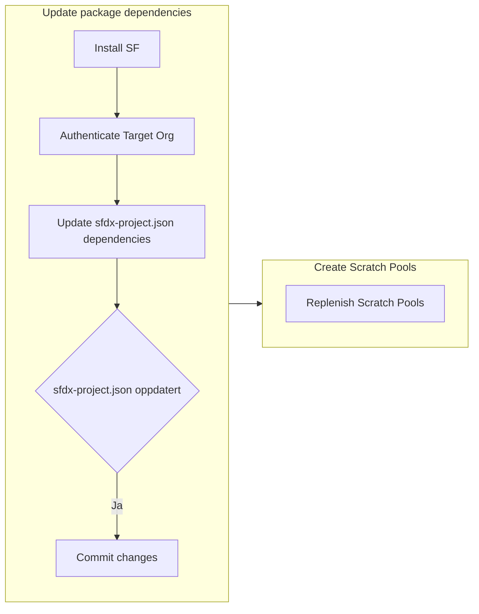

# "Replenish Pools - Auto Triggered"

Jobb som kjører på en cron jobb, kan også kalles direkte.

```mermaid
flowchart LR

    subgraph A [Update package dependencies]
        direction TB
        A1[Install SF] --> A2
        A2[Authenticate Target Org] --> A3
        A3[Update sfdx-project.json dependencies] --> A4
        A4{sfdx-project.json oppdatert} -- Ja --> A5
        A5[Commit changes]
    end
    subgraph B[Create Scratch Pools]
        direction TB
        B1[Replenish Scratch Pools]
    end

    A --> B
```
