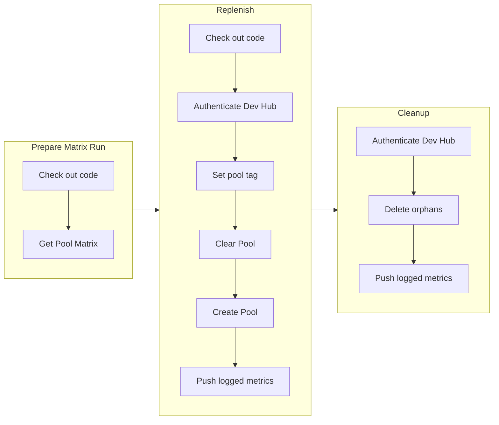

# Replenish Scratch Pools

Workflow som tar utgangspunkt i Flexibl rammeverket for å lage et eller flere scratch pools.

## Brukes på følgende måte

Kan gjenbrukes og kjøres standalone.

### Krever følgende secrets:

- `DEV_HUB_SFDX_URL`: Påkrevd, SFDX url til devhub
- `METRICS_KEY`: Påkrevd, se sf-moitoring
- `CRM_PACKAGE_KEY`: Ikke påkrevd, benyttes dersom det er pakker som krever package key.

### Krever følgende permissions:

```yml
contents: read
packages: read
```

Alle input verdier har en default verdi sånn at det er mulig å bare bruke `- uses: navikt/crm-workflows-base/.github/workflows/manageScratchPool.yml@<sha/version>`

```yml
- uses: navikt/crm-workflows-base/.github/workflows/manageScratchPool.yml@<sha/version>
    with:
        # description: Path to the file describing the pools to create
        # required: false
        # default: config/pool-matrix-def.json
        # type: string
        pool-matrix-def-path: ''
        # description: If checked, clear unused scratches in the pools
        # required: false
        # default: false
        # type: boolean
        clear-pools: false
        # description: The version of SFP to use
        # required: false
        # type: string
        sfp-version: ''
```

### Pool Matrix Definition file:

```json
{
  "pools": [
    {
      "poolConfigPath": "<Path to the flxbl>",
      "deleteJobType": "<type of delete job>",
      "isCiPool": <true|false if ci pool or not>
    },
    {
      "poolConfigPath": "config/dev-pool-def.json",
      "deleteJobType": "unassigned",
      "isCiPool": false
    }
  ]
}
```

## Flyt:


